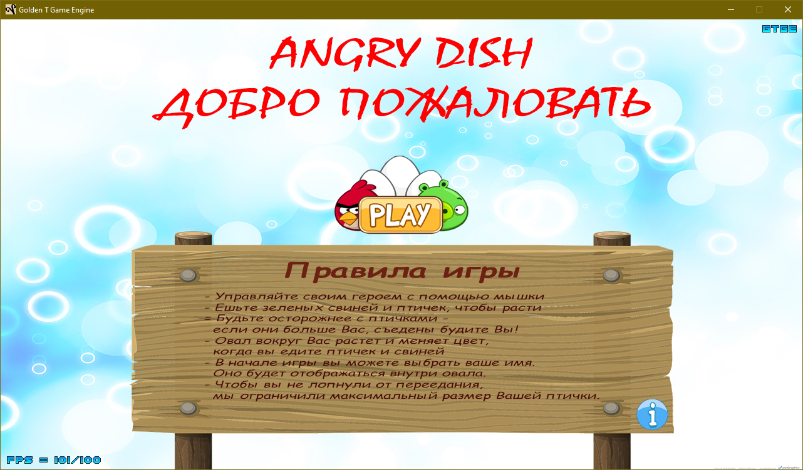
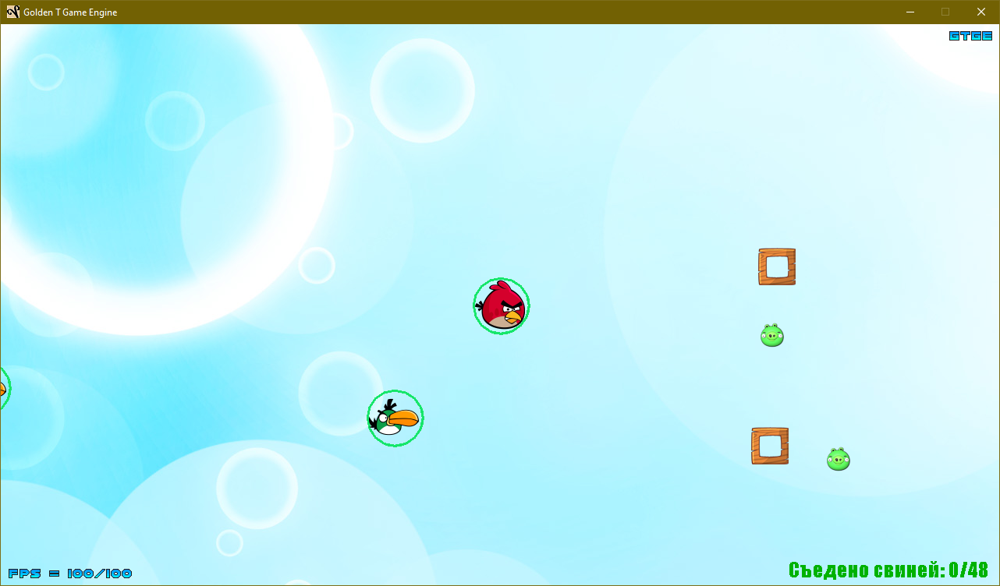
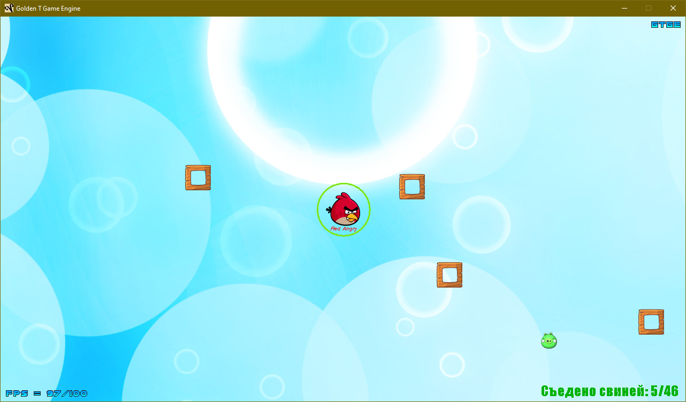
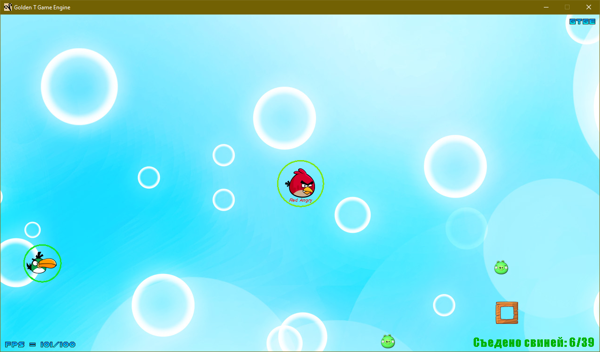
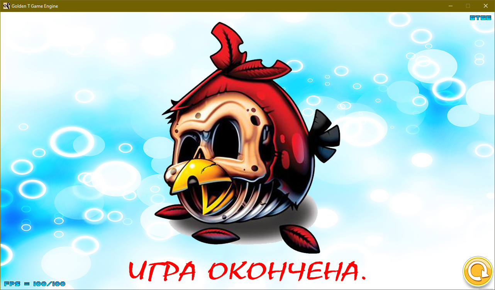

# Angry Dish
Простая 2D игра наподобие [Agar.io](https://ru.wikipedia.org/wiki/Agar.io) в стилистике [Angry Birds](https://ru.wikipedia.org/wiki/Angry_Birds).

Особенности игры:
- Главный герой - птичка Ред. Управляйте своим героем с помощью мышки.
- На поле могут встречаться препятствия в виде деревянных блоков. Ваша птичка выдержит столкновение с ними, но спасибо за это не скажет.
- Поедайте зеленых свиней и птичек, чтобы расти.
- Осторожнее с птичками - если они больше вас, съедены будете вы!
- Овал вокруг вас растет и меняет цвет, когда вы едите птичек и свиней. Чем больше вы едите, тем медленее двигаетесь.
- В начале игры вы можете выбрать имя вашего героя. Оно будет отображаться внутри овала.
- Чтовы вы не лопнули от переедания, мы ограничили максимальный размер вашей птички.
- В игре присутствует звуковое сопровождение.

Проект написан на языке Java с использованием Swing и игрового движка [Golden T Game Engine](http://goldenstudios.or.id/products/GTGE/).  
JDK 1.8.0u202

